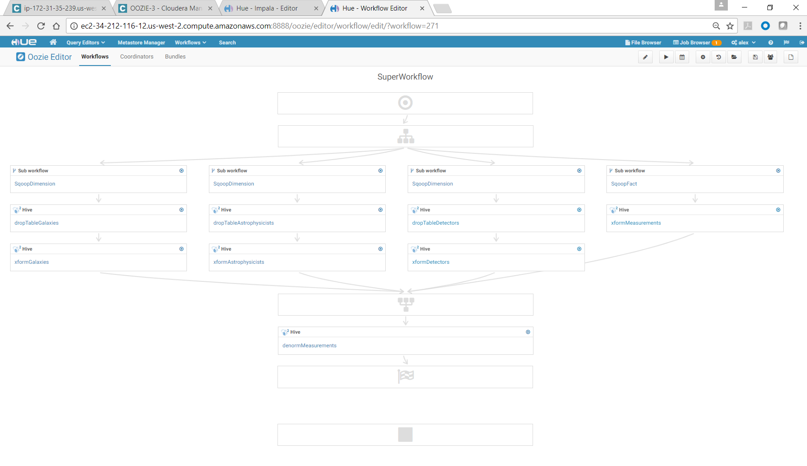
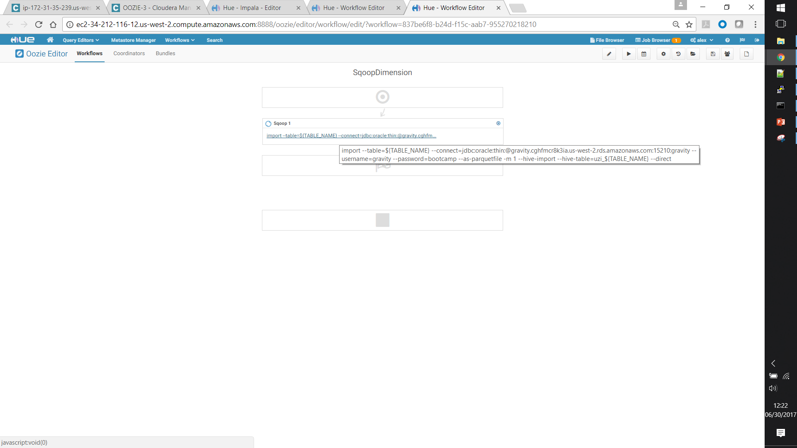

## <center>Batch Data Processing in EDH</center> 


__Create Oozie Workflow To Do the Following__

 * Import some of the measurements from Oracle (‘sqoop’ action type)

 * Import all of the reference data from Oracle (‘sqoop’ action type)
    
 * Transform the data (‘hive2’ action type)
 
   - Join all the tables
 
   - Save as Parquet
  
   - Correct data types
   
   - Add a flag attribute for gravitational waves

__Optimize the Workflow__

 * Use subworkflows for Sqoop imports

 * Import the Oracle tables in parallel

 * Add a coordinator that calls the workflow on a schedule

 * Run Hive-on-Spark instead of Hive-on-MapReduce

 * Build a Spark SQL project to run the transformations instead of Hive

---

## Solution Outline

### Oozie Workflow 

#### Combined end-to-end workflow: modular, parallel, scheduled

<center></center>


### <center>Phase 1 - Ingest</center>

#### "Dimension" ingestion workflows: parameterized by table name

<center></center>


#### "Fact" ingestion workflow: partitioned by galaxy_id

<center></center>


### <center>Phase 2 - Load from "raw" to "prod" zone</center>

#### Transformation queries

Example:

```
set hive.execution.engine=mr;

set hive.exec.dynamic.partition.mode=nonstrict;
set hive.exec.max.dynamic.partitions=200;
set hive.exec.max.dynamic.partitions.pernode=200;
set mapreduce.map.memory.mb=1536;

DROP TABLE IF EXISTS etl.measurements;
CREATE TABLE etl.measurements (
    measurement_id string, 
	detector_id smallint, 
	astrophysicist_id int, 
	measurement_time timestamp, 
	amplitude_1 double, 
	amplitude_2 double, 
	amplitude_3 double
)
PARTITIONED BY (galaxy_id int);

INSERT INTO etl.measurements 
PARTITION (galaxy_id) 
SELECT 
    measurement_id, 
    CAST(detector_id as smallint) detector_id, 
    CAST(astrophysicist_id as int) astrophysicist_id, 
    CAST(CONCAT(CONCAT(
        from_unixtime(cast(cast(measurement_time as bigint)/1000 as bigint),'yyyy-MM-dd HH:mm:ss'),'.'),cast(cast(measurement_time as bigint)%1000 as string)) 
    AS timestamp) measurement_time, 
    CAST(amplitude_1 as double) amplitude_1, 
    CAST(amplitude_2 as double) amplitude_2, 
    CAST(amplitude_3 as double) amplitude_3, 
    CAST(galaxy_id as int) galaxy_id 
FROM 
    default.uzi_measurements;

```


### <center>Phase 3 - Transform for consumption ("prod" to "presentation" zone)</center>

#### Filtering and Denormalization Query

```
DROP TABLE IF EXISTS etl.MARS;
CREATE TABLE etl.MARS
AS
SELECT 
    m.measurement_id,
    m.detector_id,
    d.detector_name,
    d.country,
    d.latitude,
    d.longitude,
    m.astrophysicist_id,
    a.astrophysicist_name,
    a.year_of_birth,
    a.nationality,
    m.measurement_time,
    m.amplitude_1,
    m.amplitude_2,
    m.amplitude_3,
    m.galaxy_id,
    g.galaxy_name,
    g.galaxy_type,
    g.distance_ly,
    g.absolute_magnitude,
    g.apparent_magnitude,
    g.galaxy_group
FROM 
    etl.measurements m INNER JOIN
    etl.detectors d ON m.detector_id=d.detector_id INNER JOIN
    etl.astrophysicists a ON m.astrophysicist_id=a.astrophysicist_id INNER JOIN
    etl.galaxies g ON m.galaxy_id=g.galaxy_id
WHERE
    m.amplitude_1 > 0.995 AND
    m.amplitude_3 > 0.995 AND
    m.amplitude_2 < 0.005 ;
    
```


