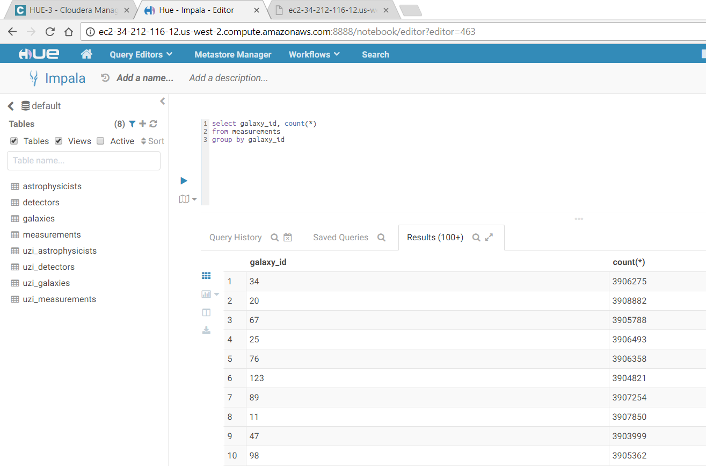
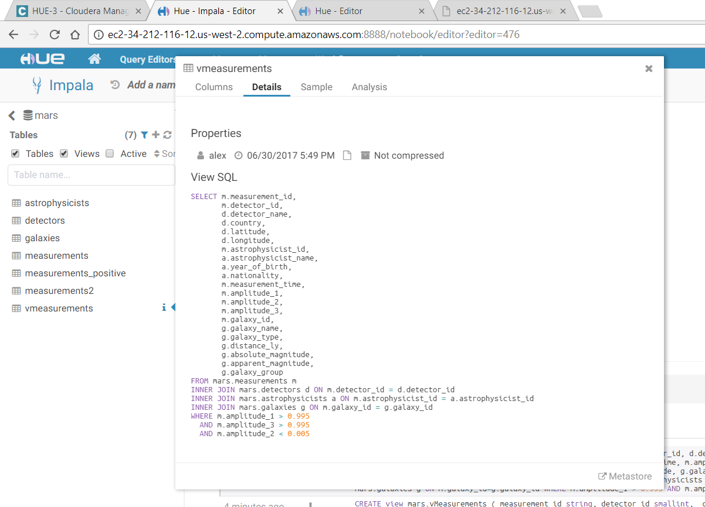

## <center>Data Ingest into CDH</center>

### <center>Ingest measurements and reference data from Oracle </center>

Tables: measurements, detectors, galaxies, astrophysicists

* 8 detectors, 128 galaxies, 106 astrophysicists
```
[ec2-user@ip-172-31-32-132 ~]$ sudo -u hdfs sqoop import --table DETECTORS ---connect jdbc:oracle:thin:@gravity.cghfmcr8k3ia.us-west-2.rds.amazonaws.com:15210:gravity --username=gravity --password=bootcamp -as-parquetfile --m 1
[ec2-user@ip-172-31-32-132 ~]$ sudo -u hdfs sqoop import --table GALAXIES ---connect jdbc:oracle:thin:@gravity.cghfmcr8k3ia.us-west-2.rds.amazonaws.com:15210:gravity --username=gravity --password=bootcamp -as-parquetfile --m 1
[ec2-user@ip-172-31-32-132 ~]$ sudo -u hdfs sqoop import --table ASTROPHYSICISTS ---connect jdbc:oracle:thin:@gravity.cghfmcr8k3ia.us-west-2.rds.amazonaws.com:15210:gravity --username=gravity --password=bootcamp -as-parquetfile --m 1
```

* 500 million measurements

```
[ec2-user@ip-172-31-32-132 ~]$ sudo -u hdfs sqoop import --table=MEASUREMENTS --connect=jdbc:oracle:thin:@gravity.cghfmcr8k3ia.us-west-2.rds.amazonaws.com:15210:gravity --username=gravity --password=bootcamp --as-parquetfile -m 12 --hive-import --hive-partition-key=galaxy_id --split-by=galaxy_id --direct
[ec2-user@ip-172-31-32-132 ~]$ 
```

---

### <center>Make the tables available to Impala for querying in Hue</center>

<center>   </center>

---

### <center>Additional functionality ideas </center>

* More import parallelism

* Write directly to Parquet

`[ec2-user@ip-172-31-32-132 ~]$ sudo -u hdfs sqoop import` 
`  --table GALAXIES `
`  --connect jdbc:oracle:thin:@gravity.cghfmcr8k3ia.us-west-2.rds.amazonaws.com:15210:gravity `
`  --username=gravity `
`  --password=xxxxxxx `
`  -m 1 `
__`  --as-parquetfile`__

---

* Compression

---

* Ingest straight into a partitioned table

`[ec2-user@ip-172-31-32-132 ~]$ sudo -u hdfs sqoop import `
`   --table=MEASUREMENTS `
`   --connect=jdbc:oracle:thin:@gravity.cghfmcr8k3ia.us-west-2.rds.amazonaws.com:15210:gravity `
`   --username=gravity `
`   --password=xxxxxxx `
`   --as-parquetfile `
`   -m 16 `
__`   --hive-import `__
__`   --hive-partition-key=galaxy_id `__
__`   --split-by=galaxy_id `__
`   --direct`

---

* Create views to simplify the presentation data model

   - Detect gravitational waves for the user

   - Pre-join reference tables
   

The below view does both:

<center> </center>

---

* Create additional tables to speed up the presentation data model

   - Physicalize the views

   - Provide pre-aggregated results

   - Convert DOUBLEs to DECIMALs


---
